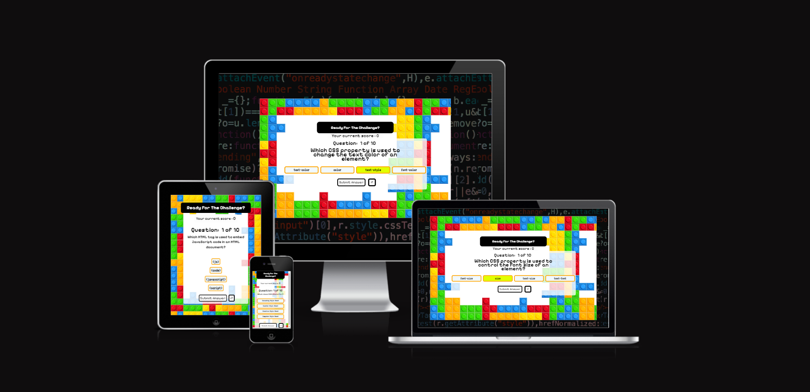
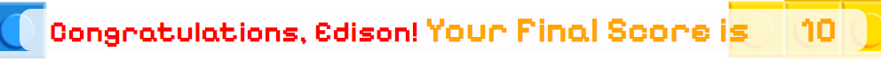
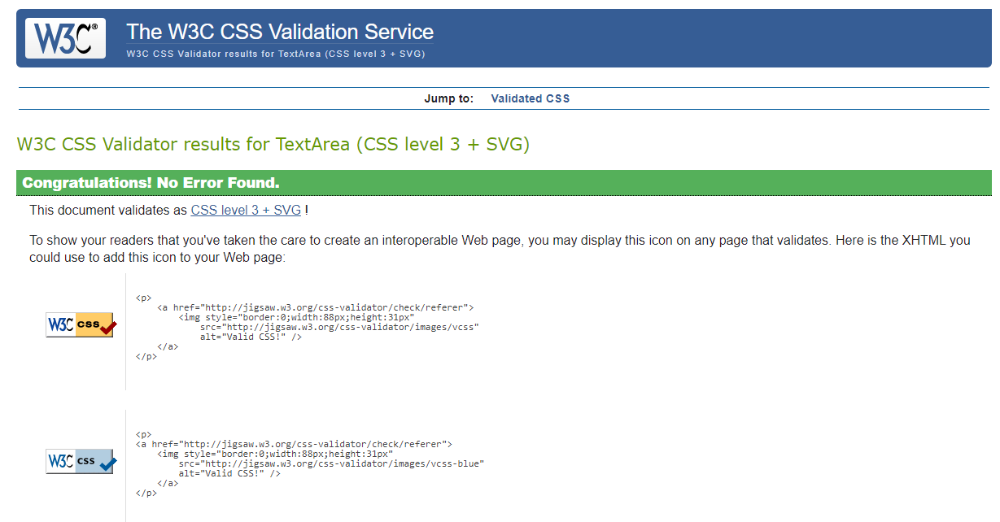

# Coding Challenge
## Welcome to Coding Challenge
Coding Challenge is a simple quiz about knowledge of basic HTML, CSS and Javascript. It contains 20 questions and the quiz will shows 10 questions randomly.

Live link can be found here - [Coding Challenge](https://edisonkwan18.github.io/project2-quiz/)

### <u>Am I Responsive ?</u>
[Image Source - Am I Responsive](https://ui.dev/amiresponsive?url=https://edisonkwan18.github.io/project2-quiz/)

## Site Owner Goals
### <u>Our Unique Offerings:</u>

- Site owner would like to let user to learn or assess the knowledge of basic HTML, CSS and Javascript by playing a quiz game.

## Features

The existing features provide the following project requirements:

### <u>Enter user name</u>

User can enter their username in here.
It will display the name when the game is completed.

### <u>Favicon and page titles</u>

A favicon has been included and each page has a title of my app name \"Coding Challenge\".

### <u>Welcome statement for user</u>

### <u>Response section (score)</u>
- Response section will interact with user by showing them the current score and inform the user when the game is completed

#### <u>Response section : Before</u>

#### <u>Response section : After</u>

**After the game is completed, a statement of "Congratulations, [username] ! Your Final Score is [score]".**

### <u>Question Counter</u>

It will shows the number of question from "Question: 1 of 10" to "Question: 1 of 10"

### <u>Question section</u>

It is the statement of question

### <u>Choice</u>

There are 4 choices for user to answer

### <u>Buttons</u>
#### <u>Submit Answer</u>

Submit answer button is able to click after user has selected the choice of answer.
The selected choice will be determinate is that correct answer or not.

#### <u>Next Question</u>

Next Question button will appear after 'Submit answer button' clicked.
The gaming page will be transferred to next question after this button clicked

#### <u>Play Again</u>

When the game is completed, this button will appear.
The entire game will be restarted when the button is clicked.
The game will go as a hard refresh.

### <u>Quit game button</u>

This button will appear for the entire game before the game is complete.
It can use for restart the game.
The entire game will be restarted when the button is clicked.
The game will go as a hard refresh.

## Screen shot of the page
### <u>The landing page image</u>

- The landing page includes following features:
- Welcome statement to welcome the user
- Response section to interact with the user
- Question counter to show the current question
- Question section to show the question
- Choices to let user select the option to answer the question
- Buttons to move forward such as "Submit" , "Next Question" & "Play Again"
- A button to quit in order to jump out current circus

### <u>Selecting choice</u>

When user want to select a choice, the background colour of choice will be yellow after it is clicked.

### <u>Submit when no choice is selected</u>

There is an alert to warn the user when user click the submit answer button with no choice selected.
It will not go to check the answer if no choice selected.

### <u>Checking answer</u>
#### <u>When answer is correct</u>

When user answer the question correctly, the selected choice will turn the colour of border from orange to green.

#### <u>When answer is incorrect</u>

When user answer the question incorrectly, the selected choice will turn the colour of border from orange to red.

### <u> Complete the game </u>

When the user complete the game, a statement will appear and inform the user the game is completed and the score they got.

After the game is completed, a statement of "Congratulations, [username] ! Your Final Score is [score]".

## Future Potential Feature
- Showing the correct answer if user answer incorrectly 
- Adding more question to question database
- Set a timer to record the time of user finishing the game
- Bulid a leaderboard to record the score and time of user

## Languages

During the development phase, we leveraged a comprehensive stack of technologies to ensure a robust and efficient web application. **HTML** served as the backbone for structuring the content and layout of our web pages, allowing us to define elements and organize information effectively.

**CSS** played a crucial role in enhancing the visual appeal and user experience of our platform. With CSS, we applied styles, customized layouts, and ensured a consistent design language throughout the application, providing an engaging interface for our users.

**Javascript** is the main core of the game. It provide interaction between user and the program. It will follow the logic to giving out feedback based on the input of the user.

### Frameworks/Libraries/Tools:

- Google Font - It provide more fonts to use [Google Font](https://fonts.google.com/)
- Fontawesome - It provide more icons [Fontawesome](https://fontawesome.com)
- W3C CSS Validation Service - Testing CSS [W3C CSS Validation Service](https://jigsaw.w3.org/css-validator/) 
- W3C Markup Validation Service - Testing HTML [W3C Markup Validation Service](https://validator.w3.org)
- Am I responsive - For responsive checking [Am I responsive](https://ui.dev/amiresponsive?url=https://edisonkwan18.github.io/project2-quiz/)
- Lighthouse testing - Testing
- Responsive test tool - Testing responsive with showing resolution [Responsive test tool](https://responsivetesttool.com/) 

## Tools and Technologies

[GitHub](https://github.com/) - Stores the repository for this project so that it can be contributed to by all members of the team. A number of github tools were also used to aid Agile development.

[git](https://git-scm.com/) - Controlled the building of this project in a series of versions which can be tracked.

[Visual Studio Code](https://code.visualstudio.com/) - The editor in which this project was built. 

## Testing and Validation
### <u>Responsiveness testing</u>
### <u>Landing page (index.html)</u>

**Credit:** [Responsive test tool](https://responsivetesttool.com/)

[Image Source - Am I Responsive](https://ui.dev/amiresponsive?url=https://edisonkwan18.github.io/project2-quiz/)

### <u>HTML testing </u>

This is pass by using W3C Markup Validation Service. 

[W3C Markup Validation Service](https://validator.w3.org/)

### <u> CSS testing </u>

This is pass by using W3C CSS Validation Service. 

[W3C CSS Validation Service](https://jigsaw.w3.org/css-validator/)

### <u> Javascript testing </u>

This is pass by using JSHint.

[JSHint](https://jshint.com/)

### <u> Accessibility </u>
The site achieved a Lighthouse (Chrome Dev tools) accessibility score of 90% which confirms that the colours and fonts chosen are easy to read and accessible

### <u> Browser Testing </u>
- The Webpage was tested on Google Chrome, Safari and Microsoft Edge web browsers with no issues observed.

## Solved Bugs

### <u> Error in the console when input (display:none) </u>
When I hide the circle of radio button, error will appear if user select one of the choice and submit it.

The error stated that 'An invalid form control with name='choice' is not focusable'

I have found out that I have used required to make sure user must select one of the choice but the display of radio button is hidden by (display:none). Therefore, the browser could not able to focus the input radio button.

With the help of my classmate Kunal, the solution is shown as below:

<u> Explain </u>
- opacity:0; -> It makes the radio button invisible
- pointer-events: none; -> It makes pointer not clicking on the radio button actually
- position: fixed -> It will stick with the label of radio button

## Known bugs

When user is entering the username, the username will be "null" if they "enter nothing" , "click cancel" or "press esc button on the keyboard"

## Version Control
### Creating branch
- I will commit and push to github. If something really go wrong then I can do git reset -hard in order to travel back to that commit.

## Deployment

The project was deployed using GitHub Pages. The steps to deploy using GitHub Pages are as follows:

1. Go to the repository on GitHub.com
2. Select 'Settings' near the top of the page.
3. Select 'Pages' from the menu bar on the left of the page.
4. Under 'Build and deployment' > 'Branch', select the 'main' branch from the dropdown menu.
5. Once selected, click the 'Save' button.
6. Deployment should be confirmed by a message on a green background saying "Your site is published at" followed by the web address.

The live link can be found here - [Coding Challenge](https://edisonkwan18.github.io/project2-quiz/)

## Credit
### <u> image </u>
| Name     |Link            | Where or why used | Author |
| -------- | ---------- | --------------------- | ------ |
|flaticon|[https://www.flaticon.com/free-icon/quiz_10292284?term=quiz&related_id=10292284](https://www.flaticon.com/free-icon/quiz_10292284?term=quiz&related_id=10292284)|Favicon|Unknown|
|pngtree|[https://pngtree.com/freepng/lego-puzzle-border_5411181.html?share=3](https://pngtree.com/freepng/lego-puzzle-border_5411181.html?share=3)|Frame of app|588ku|
|Unsplash|[https://unsplash.com/photos/captcha-cvBBO4PzWPg](https://unsplash.com/photos/captcha-cvBBO4PzWPg)|Background image|Markus Spiske

### <u> Guidance or source </u>
|Author/Website|Link or source|Where or why used|
|-------------|----|---------|
|Mike Bostock/Fisher–Yates Shuffle|[https://bost.ocks.org/mike/shuffle/](https://bost.ocks.org/mike/shuffle/)|Shuffle choice in Javascript|

### <u> Acknowledgments / Credits </u>
Thank you very much to my course tutor [Komal Karir](https://github.com/kkarir-waes) and my classmate and collaborator [Kunal](https://github.com/kun-shukla).

Mr.Komal Karir gave us the idea and steps logic how the Javascript should work. Also, he gave us a very big help on review the code and looking for bugs.

My Collaborator Kunal contributed a lot of setup the framework of the quiz and Javascript coding. He is doing very great especially on debugging the Javascript.

I would like to say thank you again for your contribution to this project.

